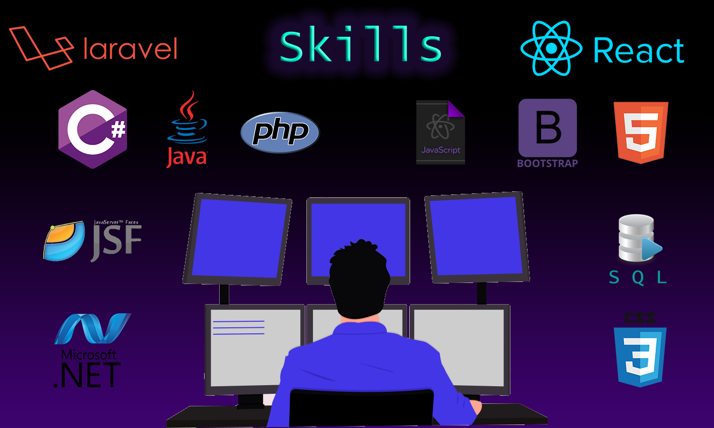

# Hi, I’m @DevMaidanaLGM (Leon) 

* I'm a recently graduate of the "University Programmer Analyst" Degree of an Engineering Faculty of Argentina. 
* I'm 25 years old 
* I'm from Argentina, so my native language is Spanish
* My English level is pretty good so we can communicate in both languages

## Portfolio: https://leon-react-portfolio.herokuapp.com/

## I'm looking for

* Improve all my develompent skills
* Get a job to grow professionally
* Improve my English level
* Learn as much as I can

## Here is some of the technologies that I use:

## Development Experience

I've been coding since went to university, I made full CRUD systems learning and using different paradigms, frameworks, technologies, languages, and techniques in there. Besides, I took some online courses, a bootcamp and I was coding as a freelancer to improve this knowledge and adquire some more experience. Last think I learned is React Native using Expo (Mobile development is not my strong area, but it was the need of a client).

I want to specialise myself on C# .NET, so I search for jobs in that area. I'm looking for a team I can learn from and grow up profesionally.

You can find my projects at my portfolio. 

These are some of the projects I can't upload in there for different reasons.

- **Website of a car dealership:** car management, users, roles, beans, login, reports.

Technologies: Java – JSF – Hibernate – PostgresSQL – iReport – Bootstrap – Spring – Eclipse –
Apache

- **System for Loan Management:** management of statements, loans, clients, payment of installments, clients, users, roles, fees, login.

Technologies: .NET – C# – Windows Forms – SQLSV Express – VS2010

## Contact me:

Linkedin: https://www.linkedin.com/in/leon-maidana/

Gmail: dev.maidanalgm@gmail.com

<!---
DevMaidanaLGM/DevMaidanaLGM is a ✨ special ✨ repository because its `README.md` (this file) appears on your GitHub profile.
You can click the Preview link to take a look at your changes.
--->
